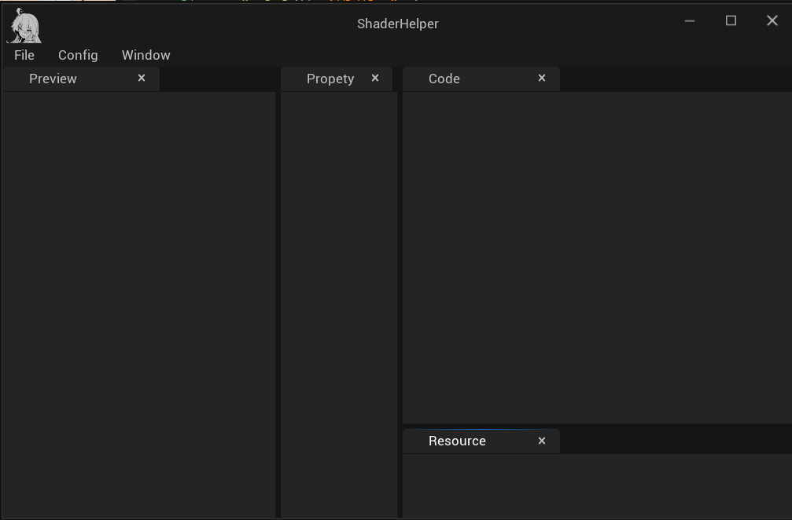

# ShaderHelper (Unfinished!)

This is a lightweight shader editor based on some special Modules from UnrealEngine (Slate, ImageWrapper ...).

## Features

* TODO

## Coding Standard

* Use `<>` syntax to include the headers from UnrealEngine.
* Custom ui should use the same naming conventions as UnrealEngine.

## Build Instructions

- [x] Windows : Open the `.sln` file created after running GenerateSolution.bat and build the project.
- [ ] MacOS
