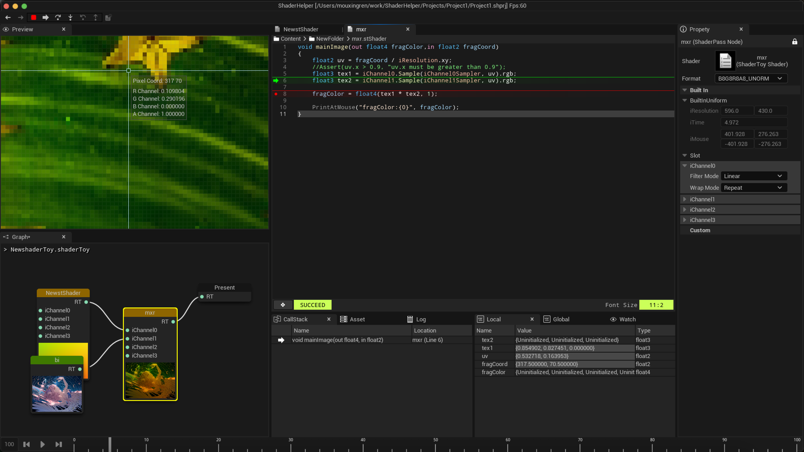

# ShaderHelper

This is a lightweight shader editor based on some special Modules from UnrealEngine (Slate, ImageWrapper ...) for easier writing shader myself. :)

## Features

* TODO

## Build Instructions

* TODO