# ShaderHelper 用户文档

ShaderHelper 通过 shader 代码编辑器实现 shading 逻辑，并使用节点编辑器可视化搭建渲染管线依赖。目前主要提供两套编写流程：面向 Shadertoy 风格创作的流程，以及面向原生 HLSL/GLSL 自由编写的流程。

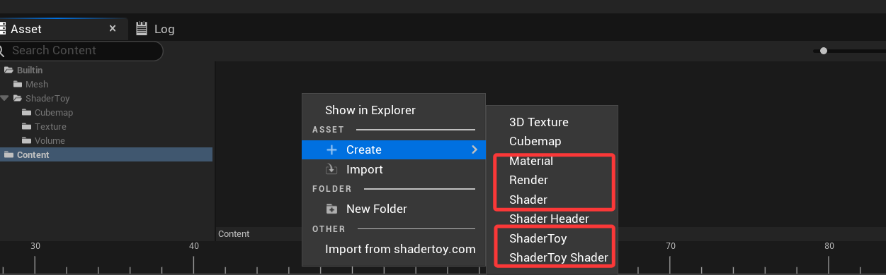

## Shadertoy 流程

该流程适合已经熟悉或偏好 Shadertoy 创作方式的用户。

1. 创建 `ShaderToy graph` 资产和 `Shadertoy shader` 资产。
2. 双击打开 `Shadertoy shader` 资产，即可进入管线搭建和 shader 编辑流程。

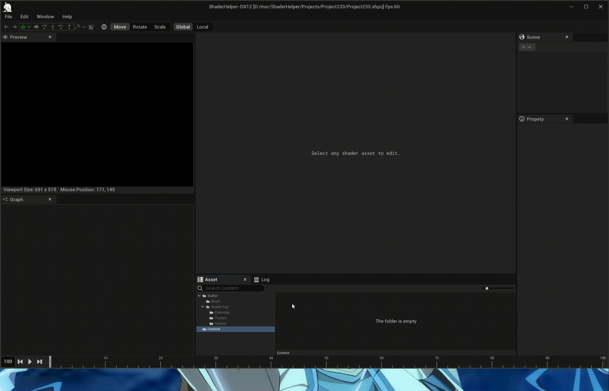

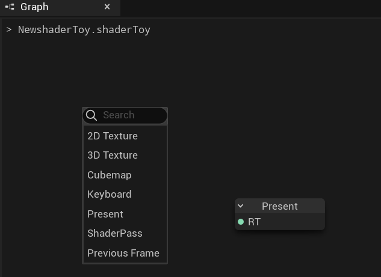

### 导入和导出 shadertoy.com

如果需要导入或导出 shadertoy.com 中的 shader，可先在 `Preferences` 中启用 `Shadertoy` 插件。

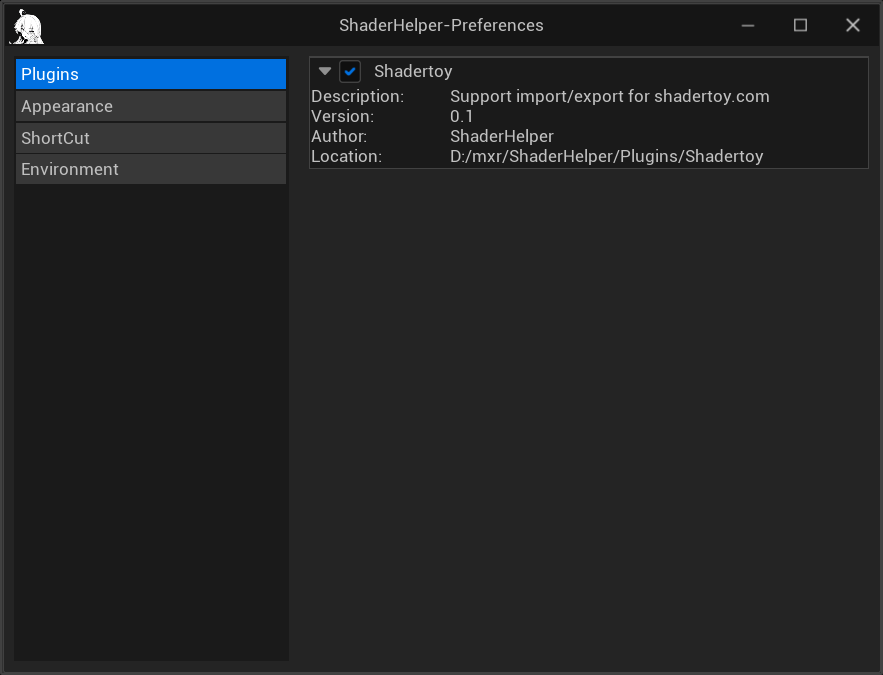

启用后，在 `AssetBrowser` 面板中右键，可选择 `Import from shadertoy.com` 执行导入。导入成功后，ShaderHelper 会自动生成对应资产。

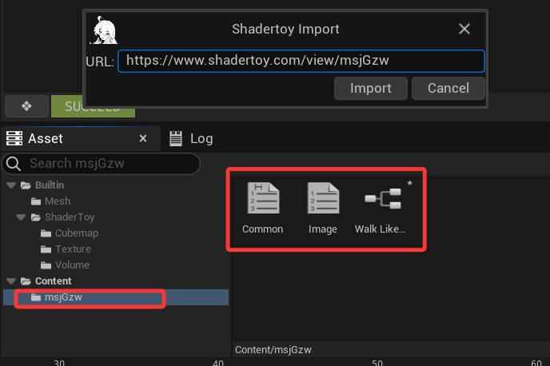

选中 Shadertoy 图中的 `Present` 节点，也可以直接导出到 shadertoy.com。

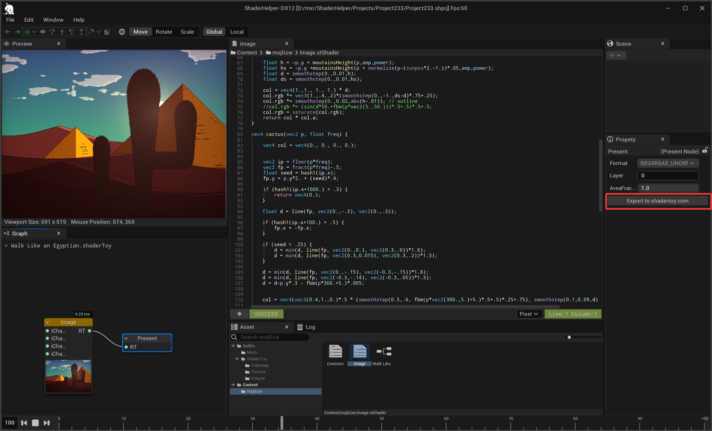

注意：shadertoy.com 不允许外部资产。如果需要将作品分享到 shadertoy.com，shader 应只依赖内建 Shadertoy 资产。

## 原生 HLSL/GLSL 流程

该流程适合希望直接编写原生 HLSL/GLSL，并自行组织渲染管线的用户。

1. 创建 `Render`、`Shader`、`Material` 资产。
2. 在 `Shader` 资产中编写 shader 代码。保存文件或点击左下方按钮都可以触发编译。
3. `Shader` 资产支持同时编写多个 stage，可在右下方选择对应 stage 的语言服务上下文。

   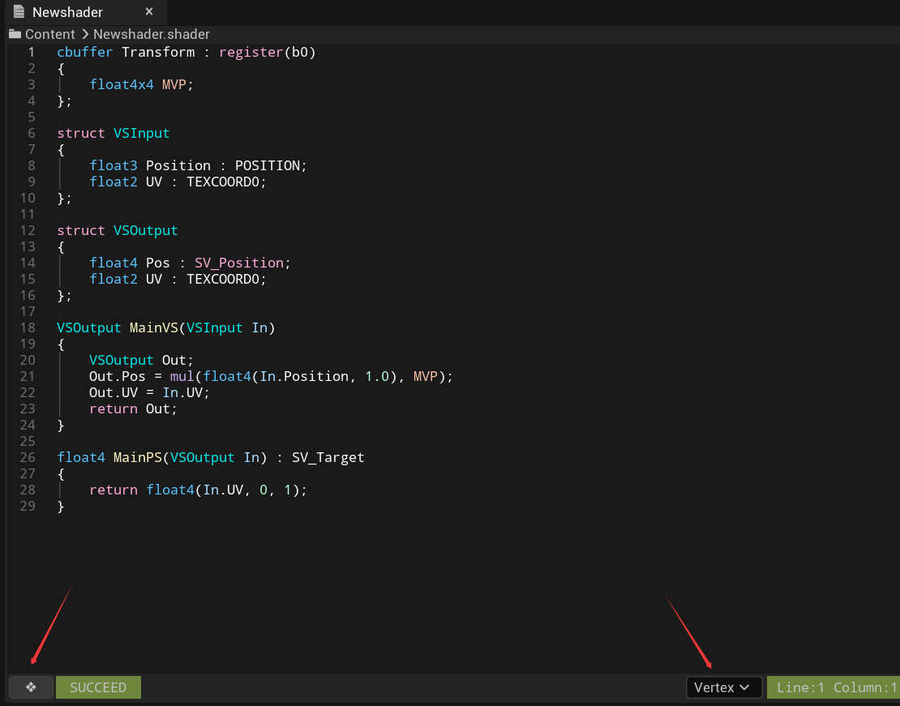

   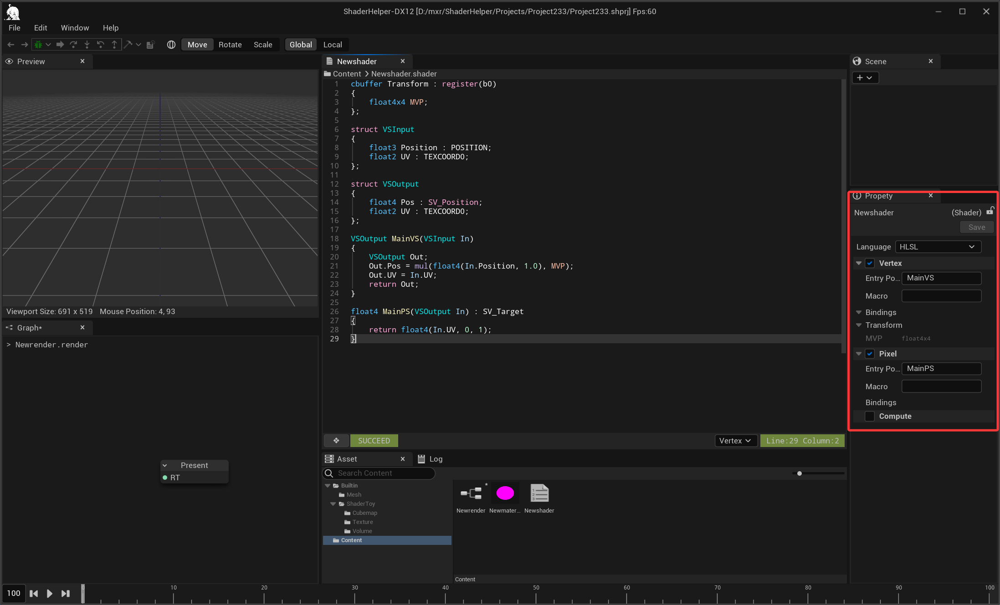

4. 在 `Material` 资产中配置 render state，并设置初始绑定数据。
5. 绑定项支持内建数据，可通过右键绑定项进行切换。

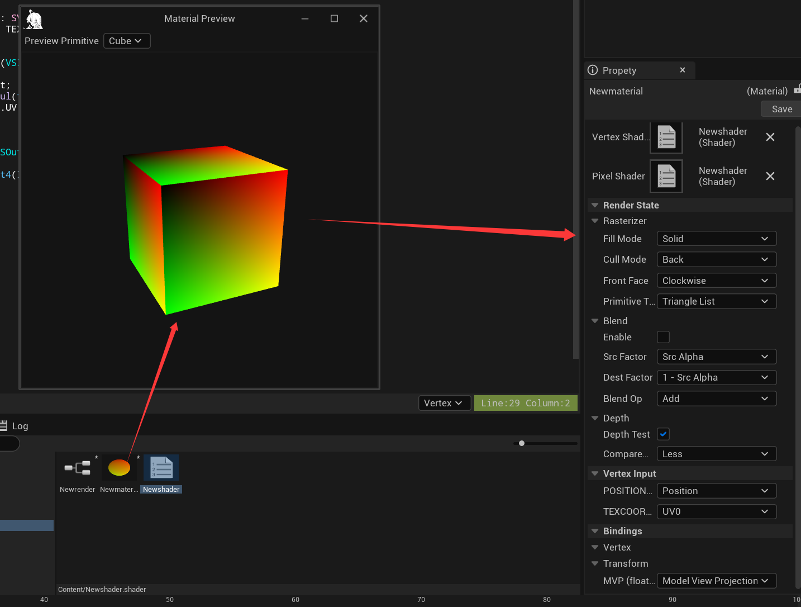

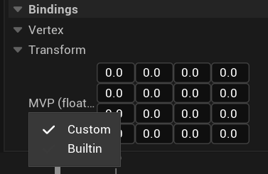

### Preview Rendering 和 Custom Rendering

原生 HLSL/GLSL 流程下提供 `Preview Rendering` 和 `Custom Rendering` 两种模式。

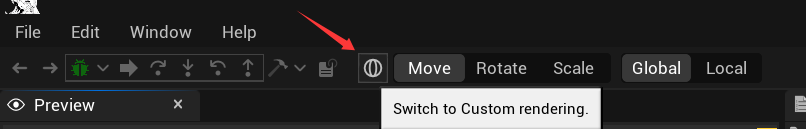

`Preview Rendering` 模式用于调整渲染所需的场景对象。`Custom Rendering` 模式会根据 `Render` 图资产中的配置进行渲染。

当设置了 `Camera` 场景对象时，它会影响内建数据的计算结果，例如 `Model`、`ViewProj`、`CameraPos` 等。

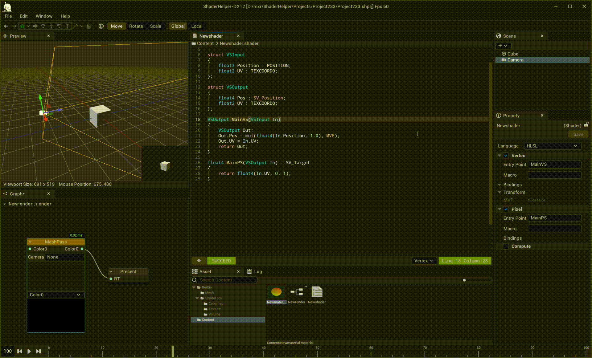

也可以设置 `Preview Camera` 来改变预览相机。

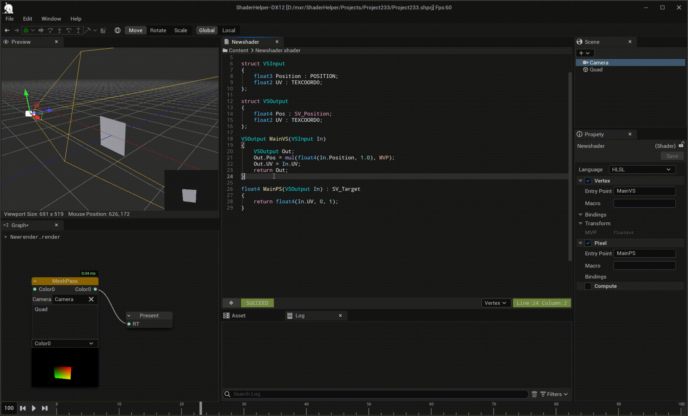

## Print 和 Assert

ShaderHelper 支持在 shader 中使用 `Print` 和 `Assert` 辅助观察运行结果与定位问题。

```hlsl
Print("{0},{1},{2}", t1, t2, t3); // 目前至多支持 3 个参数
PrintAtMouse("{0}", t);           // 打印鼠标处的结果，仅在 Shadertoy shader 中有效

Assert(uv.x > 0.9);
Assert(uv.x > 0.9, "uv.x must be greater than 0.9");
AssertFormat(uv.x > 0.9, "uv.x {0} must be greater than 0.9", uv.x);
```

`Print` 和 `Assert` 的结果可以在 log 中查看。

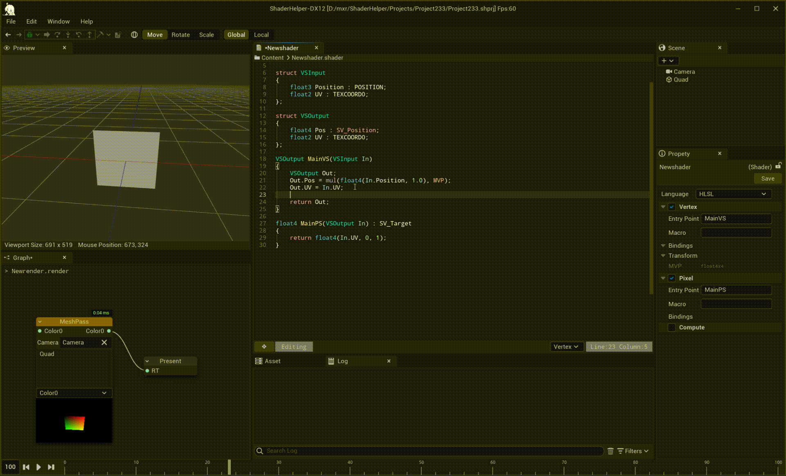

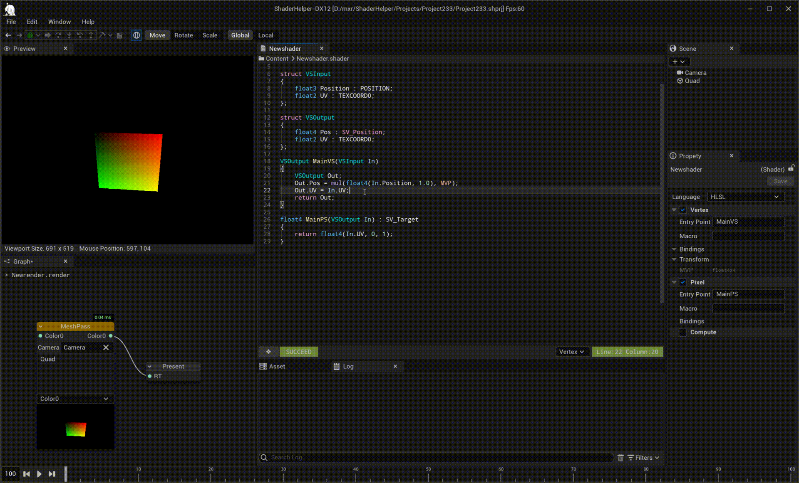

当 `Assert` 条件不满足时，对应的顶点、像素或线程在调试时会被高亮为粉色。

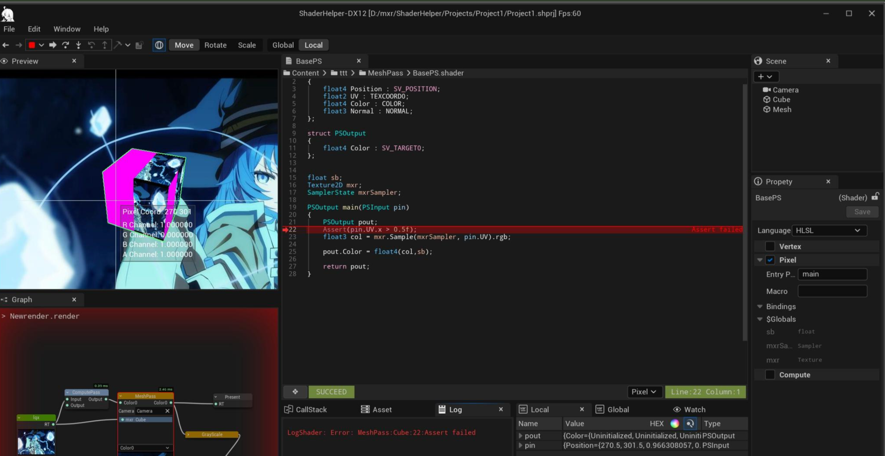

## Shader 调试

ShaderHelper 支持 vertex shader、pixel shader 和 compute shader 单步调试。调试器并非通过 CPU 虚拟机模拟 shader，而是通过插桩并回读 GPU 结果工作，因此在某些情况下会比虚拟机模拟更接近真实 GPU 执行结果。

1. 选中 `Render` 图中的 `MeshPass` 节点 `RenderObject`，可选择进行 Vertex 或 Pixel 调试。
2. 选中 `Render` 图中的 `ComputePass` 节点，可进行 Compute 调试。

   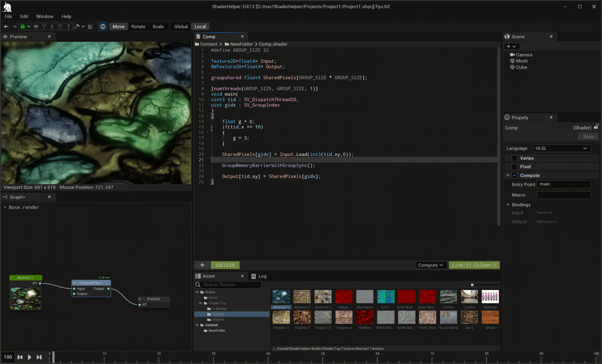

3. 选中 `Shadertoy` 图中的 `ShaderPass` 节点，可进行 Pixel 调试。

   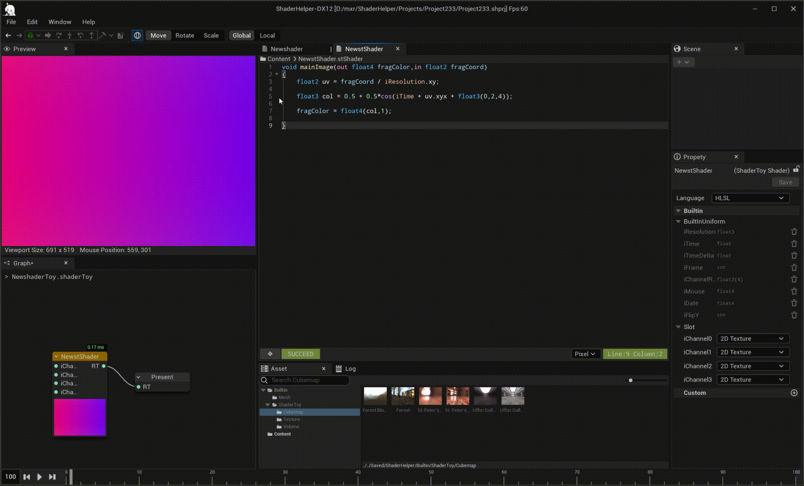

## Pixel Shader 全局检视

在单步调试 pixel shader 时，可以对每行结果进行全局检视。该功能支持循环和包含头文件的代码。

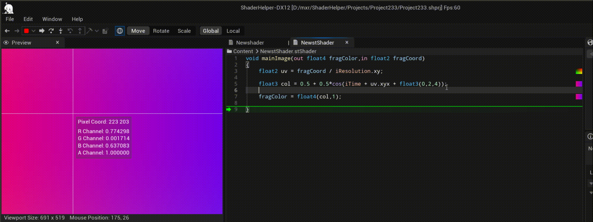

## UBSan 验证

ShaderHelper 可以帮助验证 shader 中的潜在问题。该功能可在 `Preferences` -> `Environment` 中开启 `UBSan`。

开启 `UBSan` 后，调试 shader 时如果遇到潜在问题将会报错。如果希望全局验证整个 shader，可点击 toolbar 中的 validation 按钮。

注意：开启 `UBSan` 会在一定程度上影响调试效率。

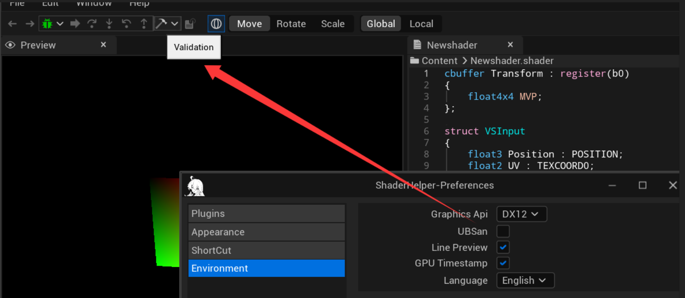
